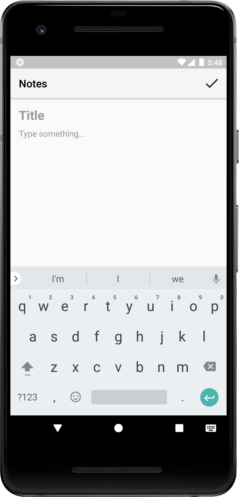
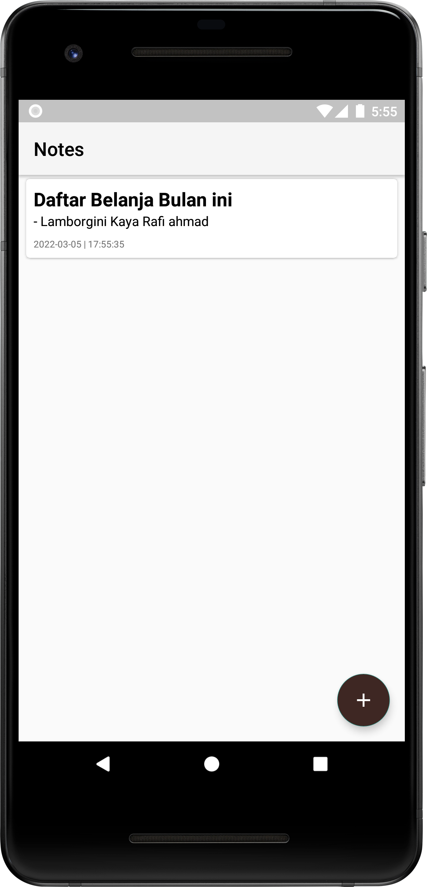
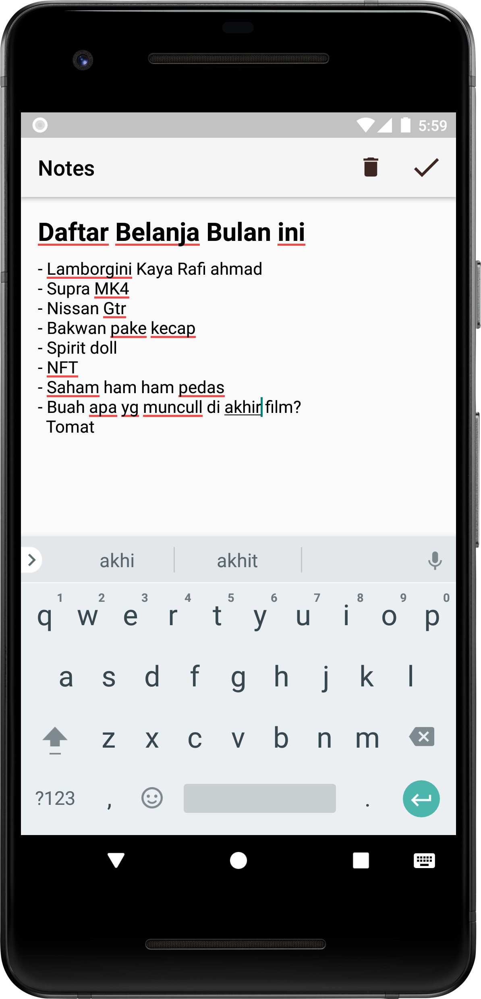

# CRUDFirebase
Simple Note using Firebase-firestore(MVVM)

## Components:
- Navigation Graph
- NavSafe Args with Parcelable
- Firebase-Firestore
- RecyclerView-DiffUtil
- ViewModel
- Live Data
- Lottie
- Menu Action bar

## Screenshot

  
  
  
  

